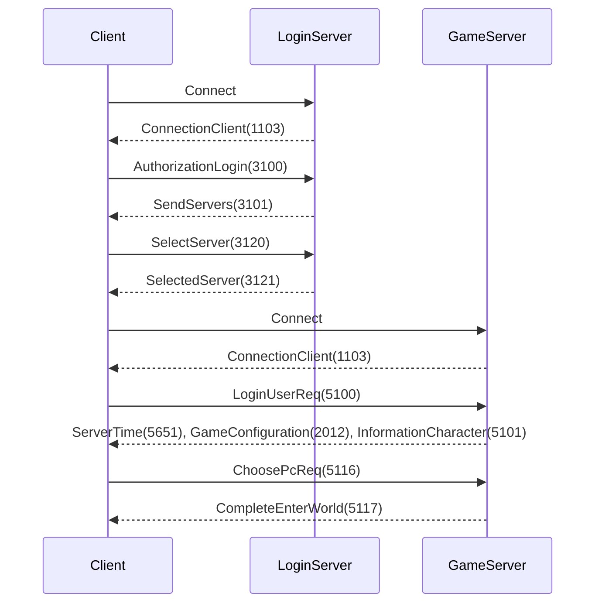
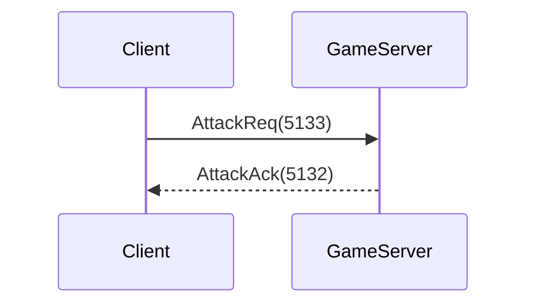
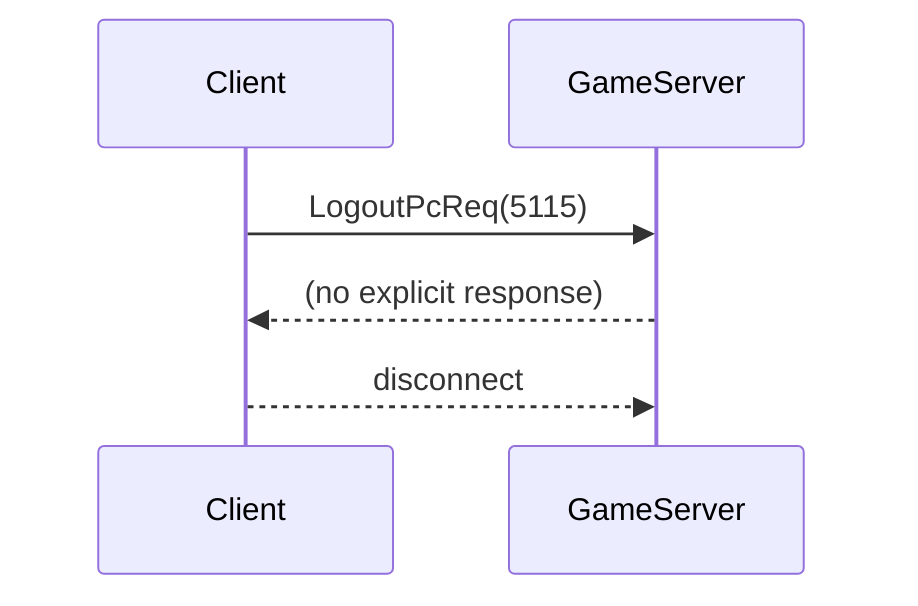

# R2 Online Protocol Guide

## TL;DR
Documentation of packet structure and handshake for the login and game servers of the R2 Online emulator. Packets begin with a crypt flag, packet number and opcode. Some messages are encrypted with Blowfish; the server initially sends the decryption key.

## 1. Overview
### Channels
- **Login server**: handles account authentication and server selection.
- **Game server**: handles character data, movement and gameplay actions.

Both use a TCP connection with the same framing:
```
[crypt:1][seq:1][opcode:2][payload][len:2]
```
`len` is appended at the front after constructing the packet.

### Encryption
`BlowfishCrypt.Decrypt` holds a 144 byte static key. Incoming packets with `crypt` byte set to `1` are decrypted before parsing. Outgoing packets currently set `crypt=0` and do not encrypt (TODO in code).

### Handshake
1. Client connects; server sends `ConnectionClient` (opcode `1103`) containing the decryption key. See `AuthorizationFactory.SendWelcome`.
2. Client sends login or session info depending on server.
3. Login server responds with server list; client selects a server and opens a game connection.
4. Game server validates session (`LoginUserReq`), sends configuration and character info, then waits for `ChoosePcReq`.

## 2. Packet Specification
The table below lists packet models found in the repository.

| Opcode | Name | Direction | Source file |
|-------:|------|-----------|-------------|
| 5160 | AbnormalAck | S->C | Packets/Packets.Server.Game/Models/Send/Action/5160_AbnormalAckModel.cs |
| 5163 | AbnormalRemoveReq | C->S | Packets/Packets.Server.Game/Models/Receive/Action/5163_AbnormalCancelReqModel.cs |
| 5161 | AbnormaleReleaseAck | S->C | Packets/Packets.Server.Game/Models/Send/Action/5161_AbnormalReleaseAckModel.cs |
| 5132 | AttackAck | S->C | Packets/Packets.Server.Game/Models/Send/Attack/5132_AttackAckModel.cs |
| 5133 | AttackReq | C->S | Packets/Packets.Server.Game/Models/Receive/Attack/5133_AttackReqModel.cs |
| 5134 | AttackStopAck | S->C | Packets/Packets.Server.Game/Models/Send/Attack/5134_AttackStopAckModel.cs |
| 3100 | AuthorizationLogin | C->S | Packets/Packets.Server.Login/Models/Receive/3100_AuthorizationLoginModel.cs |
| 5195 | CharDirAck | S->C | Packets/Packets.Server.Game/Models/Send/Character/5195_CharDirModel.cs |
| 5194 | CharDirReq | C->S | Packets/Packets.Server.Game/Models/Receive/Character/5194_CharDirReqModel.cs |
| 5192 | CharJumpReq | C->S | Packets/Packets.Server.Game/Models/Receive/Character/5192_CharJumpReqModel.cs |
| 2034 | ChatAck | S->C | Packets/Packets.Server.Game/Models/Send/Chat/2034_ChatAckModel.cs |
| 2033 | ChatReq | C->S | Packets/Packets.Server.Game/Models/Receive/Chat/2033_ChatReqModel.cs |
| 5813 | CheckNeedMoney | S->C | Packets/Packets.Server.Game/Models/Send/Settings/5813_CheckNeedMoneyModel.cs |
| 5116 | ChoosePcReq | C->S | Packets/Packets.Server.Game/Models/Receive/5116_ChoosePcReqModel.cs |
| 5119 | CompleteCreateCharacter | S->C | Packets/Packets.Server.Game/Models/Send/Character/5119_CompleteCreateCharacterModel.cs |
| 5121 | CompleteDeleteCharacter | S->C | Packets/Packets.Server.Game/Models/Send/Character/5121_CompleteDeleteCharacterModel.cs |
| 5117 | CompleteEnterWorld | S->C | Packets/Packets.Server.Game/Models/Send/5117_CompleteEnterWorldModel.cs |
| 1103 | ConnectionClient | S->C | Packets/Packets.Server.Game/Models/Send/1103_ConnectionClientModel.cs |
| 1103 | ConnectionClient | S->C | Packets/Packets.Server.Login/Models/Send/1103_ConnectionClientModel.cs |
| 5118 | CreatePcReq | C->S | Packets/Packets.Server.Game/Models/Receive/Character/5118_CreatePcReqModel.cs |
| 5137 | DeadAck | S->C | Packets/Packets.Server.Game/Models/Send/Attack/5137_DeadAckModel.cs |
| 5120 | DeletePcReq | C->S | Packets/Packets.Server.Game/Models/Receive/Character/5120_DeletePcReqModel.cs |
| 5103 | DisplayedCharacter | S->C | Packets/Packets.Server.Game/Models/Send/Character/5103_DisplayedCharacterModel.cs |
| 5188 | DoMoveReq | C->S | Packets/Packets.Server.Game/Models/Receive/Character/5188_DoMoveReqModel.cs |
| 5190 | DoMoveToAck | S->C | Packets/Packets.Server.Game/Models/Send/MonsterNpc/5190_DoMoveToAckModel.cs |
| 5835 | EmoticonAck | S->C | Packets/Packets.Server.Game/Models/Send/Chat/5835_EmoticonAckModel.cs |
| 5834 | EmoticonReq | C->S | Packets/Packets.Server.Game/Models/Receive/Chat/5834_EmoticonReqModel.cs |
| 5105 | EnteredItemAck | S->C | Packets/Packets.Server.Game/Models/Send/Inventory/5105_EnteredItemAckModel.cs |
| 5104 | EnteredMonAck | S->C | Packets/Packets.Server.Game/Models/Send/MonsterNpc/5104_EnteredMonAckModel.cs |
| 5129 | EquipAckAll | S->C | Packets/Packets.Server.Game/Models/Send/Inventory/5129_EquipAckAllModel.cs |
| 5128 | EquipReq | C->S | Packets/Packets.Server.Game/Models/Receive/Inventory/5128_EquipReqModel.cs |
| 5110 | ExistedItemAck | S->C | Packets/Packets.Server.Game/Models/Send/Inventory/5110_ExistedItemAckModel.cs |
| 5108 | ExistedMonAck | S->C | Packets/Packets.Server.Game/Models/Send/MonsterNpc/5108_ExistedMonAckModel.cs |
| 5107 | ExistedPcAck | S->C | Packets/Packets.Server.Game/Models/Send/Character/5107_ExistedPcAckModel.cs |
| 5114 | ExitMapGbjAck | S->C | Packets/Packets.Server.Game/Models/Send/Inventory/5114_ExitMapGbjAckModel.cs |
| 1102 | GameServerError | S->C | Packets/Packets.Server.Game/Models/Send/1102_GameServerErrorModel.cs |
| 5226 | GlobalChatAck | S->C | Packets/Packets.Server.Game/Models/Send/Chat/5226_GlobalChatAckModel.cs |
| 5225 | GlobalChatReq | C->S | Packets/Packets.Server.Game/Models/Receive/Chat/5225_GlobalChatReqModel.cs |
| 5212 | GossipAck | S->C | Packets/Packets.Server.Game/Models/Send/Chat/5212_GossipAckModel.cs |
| 5146 | HealthPointCharacteristic | S->C | Packets/Packets.Server.Game/Models/Send/Character/Characteristics/5146_HealthPointCharacteristicModel.cs |
| 5139 | InfoExpAck | S->C | Packets/Packets.Server.Game/Models/Send/Level/5139_InfoExpAckModel.cs |
| 5173 | InfoStomachAck | S->C | Packets/Packets.Server.Game/Models/Send/Character/5173_InfoStomachModel.cs |
| 5149 | InfoWeightAck | S->C | Packets/Packets.Server.Game/Models/Send/Inventory/5149_InfoWeightAckModel.cs |
| 5101 | InformationCharacter | S->C | Packets/Packets.Server.Game/Models/Send/Character/5101_InformationCharacterModel.cs |
| 5145 | InventoryCharacteristic | S->C | Packets/Packets.Server.Game/Models/Send/Character/Characteristics/5145_InventoryCharacteristicModel.cs |
| 5232 | ItemAddAck | S->C | Packets/Packets.Server.Game/Models/Send/Inventory/5232_ItemAddAckModel.cs |
| 5237 | ItemChangeAck | S->C | Packets/Packets.Server.Game/Models/Send/Inventory/5237_ItemChangeAckModel.cs |
| 5654 | ItemCooldown | S->C | Packets/Packets.Server.Game/Models/Send/Action/5654_ItemCooldownAckModel.cs |
| 5159 | ItemDropReq | C->S | Packets/Packets.Server.Game/Models/Receive/Inventory/5159_ItemDropReqModel.cs |
| 5177 | ItemPickupReq | C->S | Packets/Packets.Server.Game/Models/Receive/Inventory/5177_ItemPickupReqModel.cs |
| 5233 | ItemRemoveAck | S->C | Packets/Packets.Server.Game/Models/Send/Inventory/5233_ItemRemoveAckModel.cs |
| 5653 | ItemUseAck | S->C | Packets/Packets.Server.Game/Models/Send/Inventory/5653_ItemUseAckModel.cs |
| 5158 | ItemUseReq | C->S | Packets/Packets.Server.Game/Models/Receive/Inventory/5158_ItemUseReqModel.cs |
| 5193 | JumpEndCharacter | S->C | Packets/Packets.Server.Game/Models/Send/Character/5193_JumpEndCharacterModel.cs |
| 5140 | LevelUpAck | S->C | Packets/Packets.Server.Game/Models/Send/Level/5140_LevelUpAckModel.cs |
| 3102 | LoginServerError | S->C | Packets/Packets.Server.Login/Models/Send/3102_LoginServerErrorModel.cs |
| 5100 | LoginUserReq | C->S | Packets/Packets.Server.Game/Models/Receive/5100_LoginUserReqModel.cs |
| 5115 | LogoutPcReq | C->S | Packets/Packets.Server.Game/Models/Receive/5115_LogoutPcReqModel.cs |
| 5273 | MerchantBuyReq | C->S | Packets/Packets.Server.Game/Models/Receive/Npc/5273_MerchantBuyReqModel.cs |
| 5271 | MerchantListAck | S->C | Packets/Packets.Server.Game/Models/Send/Npc/5271_MerchantListAckModel.cs |
| 5189 | MovedCharacter | S->C | Packets/Packets.Server.Game/Models/Send/Character/5189_MovedCharacterModel.cs |
| 3115 | RefreshServers | C->S | Packets/Packets.Server.Login/Models/Receive/3115_RefreshServersModel.cs |
| 3116 | RefreshedServers | S->C | Packets/Packets.Server.Login/Models/Send/3116_RefreshedServersModel.cs |
| 5169 | ReinforceAck | S->C | Packets/Packets.Server.Game/Models/Send/Inventory/5169_ReinforceAckModel.cs |
| 5170 | ReinforceNak1 | S->C | Packets/Packets.Server.Game/Models/Send/Inventory/5170_ReinforceNak1Model.cs |
| 5168 | ReinforceReq | C->S | Packets/Packets.Server.Game/Models/Receive/Inventory/5168_ReinforceReqModel.cs |
| 5142 | RespawnAck | S->C | Packets/Packets.Server.Game/Models/Send/Character/5142_RespawnAckModel.cs |
| 5141 | RespawnReq | C->S | Packets/Packets.Server.Game/Models/Receive/Character/5141_RespawnReqModel.cs |
| 5902 | ScrDialogNoMsg2Ack | S->C | Packets/Packets.Server.Game/Models/Send/Npc/5902_ScrDialogNoMsg2AckModel.cs |
| 5152 | ScriptProcReq | C->S | Packets/Packets.Server.Game/Models/Receive/Npc/5152_ScriptProcReqModel.cs |
| 5151 | ScriptReq | C->S | Packets/Packets.Server.Game/Models/Receive/Npc/5151_ScriptReqModel.cs |
| 3120 | SelectServer | C->S | Packets/Packets.Server.Login/Models/Receive/3120_SelectServerModel.cs |
| 3121 | SelectedServer | S->C | Packets/Packets.Server.Login/Models/Send/3121_SelectedServerModel.cs |
| 3101 | SendServers | S->C | Packets/Packets.Server.Login/Models/Send/3101_SendServersModel.cs |
| 5651 | ServerTime | S->C | Packets/Packets.Server.Game/Models/Send/Settings/5651_ServerTimeModel.cs |
| 5147 | SpeedCharacteristic | S->C | Packets/Packets.Server.Game/Models/Send/Character/Characteristics/5147_SpeedCharacteristicModel.cs |
| 5179 | TransformAck | S->C | Packets/Packets.Server.Game/Models/Send/Action/5179_TransformAckModel.cs |
| 5131 | UnEquipAckAll | S->C | Packets/Packets.Server.Game/Models/Send/Inventory/5131_UnEquipAckAllModel.cs |
| 5130 | UnEquipReq | C->S | Packets/Packets.Server.Game/Models/Receive/Inventory/5130_UnEquipReqModel.cs |
| 5792 | UseSkillPackAck | S->C | Packets/Packets.Server.Game/Models/Send/Action/5792_UseSkillPackAckModel.cs |
| 5784 | UseSkillPackReq | C->S | Packets/Packets.Server.Game/Models/Receive/Action/5784_UseSkillPackReqModel.cs |


## 3. Sequence Diagrams






## 4. Error Codes
Server may send `GameServerError` or `LoginServerError` packets. Examples:
- `NoUserNotLogin` (`3461165659`) when session is invalid.
- `PasswordWrong` (`2493403489`) on incorrect credentials.

## 5. Porting Notes
- Preserve packet framing and order of fields. Some packets include padding via `AddZeroBytes`.
- Blowfish decryption uses a fixed 144-byte key. Encryption is not implemented; clients expect the welcome key but data may be sent unencrypted.
- Timing for login flow (server list then game connect) should be kept but game logic can be stubbed.

